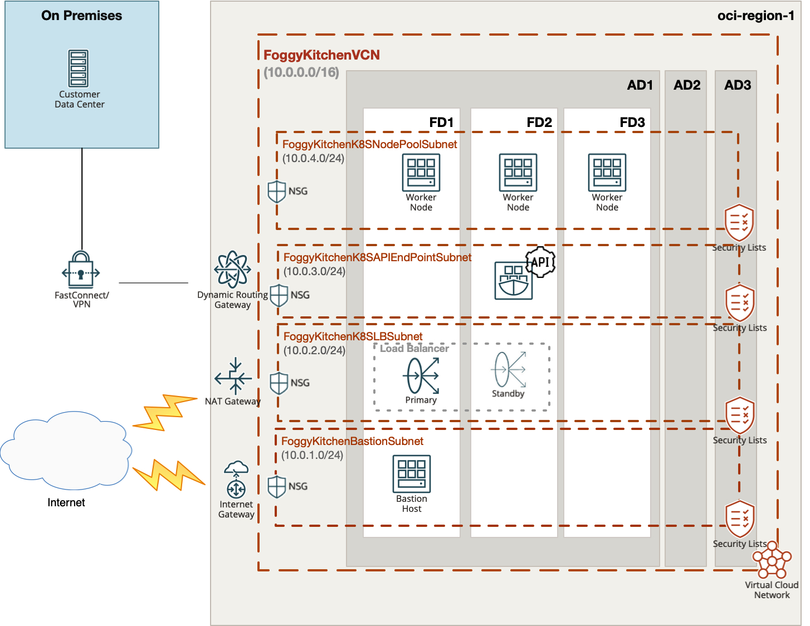

# Terraform Private OCI Container Engine for Kubernetes (aka OCI OKE)

## Project description

In this repository, I have documented my hands on experience with Terrafrom for the purpose of Container Engine for Kubernetes (aka OCI OKE) deployment in private subnets. This set of HCL based Terraform files which can customized according to any requirements.  

## Topology Diagram 

With the usage of this example HCL code you can build topology documented by diagram below. This topology is extremly simplified for education purposes and rather cannot be used for production implementations. 



## How to use code 

### Deploy Using Oracle Resource Manager

1. Click [](https://cloud.oracle.com/resourcemanager/stacks/create?region=home&zipUrl=https://github.com/mlinxfeld/terraform-oci-private-oke/releases/latest/download/terraform-oci-private-oke-stack-latest.zip)

    If you aren't already signed in, when prompted, enter the tenancy and user credentials.

2. Review and accept the terms and conditions.

3. Select the region where you want to deploy the stack.

4. Follow the on-screen prompts and instructions to create the stack.

5. After creating the stack, click **Terraform Actions**, and select **Plan**.

6. Wait for the job to be completed, and review the plan.

    To make any changes, return to the Stack Details page, click **Edit Stack**, and make the required changes. Then, run the **Plan** action again.

7. If no further changes are necessary, return to the Stack Details page, click **Terraform Actions**, and select **Apply**. 

### Deploy Using the Terraform CLI

#### STEP 1.

Clone the repo from GitHub.com by executing the command as follows and then go to terraform-oci-private-oke directory:

```
[opc@terraform-server ~]$ git clone https://github.com/mlinxfeld/terraform-oci-private-oke.git
Cloning into 'terraform-oci-private-oke'...
remote: Enumerating objects: 10, done.
remote: Counting objects: 100% (10/10), done.
remote: Compressing objects: 100% (10/10), done.
remote: Total 10 (delta 0), reused 10 (delta 0), pack-reused 0
Unpacking objects: 100% (10/10), done.

[opc@terraform-server ~]$ cd terraform-oci-private-oke/

[opc@terraform-server terraform-oci-private-oke]$ ls -latr
drwxr-xr-x  59 opc opc  1888 25 mar 12:07 ..
-rw-r--r--@  1 opc opc  8926 25 mar 12:15 README.md
-rwxr-xr-x   1 opc opc   686 25 mar 12:15 bastionserver.tf
-rw-r--r--   1 opc opc   144 25 mar 12:15 compartment.tf
-rw-r--r--   1 opc opc  1333 25 mar 12:15 datasources.tf
-rw-r--r--   1 opc opc  8282 25 mar 12:15 network.tf
-rw-r--r--   1 opc opc  2116 25 mar 12:15 oke_cluster.tf
-rw-r--r--   1 opc opc   468 25 mar 12:15 oke_kube_config.tf
-rw-r--r--   1 opc opc   249 25 mar 12:15 oke_policy.tf
-rw-r--r--   1 opc opc  1176 25 mar 12:15 outputs.tf
-rw-r--r--   1 opc opc   203 25 mar 12:15 provider.tf
-rw-r--r--   1 opc opc  2376 25 mar 12:15 remote.tf
drwxr-xr-x  16 opc opc   512 25 mar 12:15 .
drwxr-xr-x   3 opc opc    96 25 mar 12:15 templates
-rw-r--r--   1 opc opc  2008 25 mar 12:15 variables.tf
```

#### STEP 2.

Within web browser go to URL: https://www.terraform.io/downloads.html. Find your platform and download the latest version of your terraform runtime. Add directory of terraform binary into PATH and check terraform version:

```
[opc@terraform-server terraform-oci-private-oke]$ export PATH=$PATH:/home/opc/terraform

[opc@terraform-server terraform-oci-private-oke]$ terraform --version

Terraform v0.14.7

Your version of Terraform is out of date! The latest version
is 0.14.9. You can update by downloading from https://www.terraform.io/downloads.htmll
```

#### STEP 3. 
Next create environment file with TF_VARs:

```
[opc@terraform-server terraform-oci-private-oke]$ vi setup_oci_tf_vars.sh
export TF_VAR_user_ocid="ocid1.user.oc1..aaaaaaaaob4qbf2(...)uunizjie4his4vgh3jx5jxa"
export TF_VAR_tenancy_ocid="ocid1.tenancy.oc1..aaaaaaaas(...)krj2s3gdbz7d2heqzzxn7pe64ksbia"
export TF_VAR_compartment_ocid="ocid1.tenancy.oc1..aaaaaaaasbktyckn(...)ldkrj2s3gdbz7d2heqzzxn7pe64ksbia"
export TF_VAR_fingerprint="00:f9:d1:41:bb:57(...)82:47:e6:00"
export TF_VAR_private_key_path="/tmp/oci_api_key.pem"
export TF_VAR_region="eu-frankfurt-1"
export TF_VAR_private_key_oci="/tmp/id_rsa"
export TF_VAR_public_key_oci="/tmp/id_rsa.pub"
export TF_VAR_availablity_domain_name = "TkCH:EU-FRANKFURT-AD-1"

[opc@terraform-server terraform-oci-private-oke]$ source setup_oci_tf_vars.sh
```

#### STEP 4.
Run *terraform init* with upgrade option just to download the lastest neccesary providers:

```
[opc@terraform-server terraform-oci-private-oke]$ terraform init 

Initializing the backend...

Initializing provider plugins...
- Finding latest version of hashicorp/template...
- Finding latest version of hashicorp/oci...
- Finding latest version of hashicorp/tls...
- Finding latest version of hashicorp/local...
- Finding latest version of hashicorp/null...
- Using previously-installed hashicorp/template v2.2.0
- Installing hashicorp/oci v4.32.0...
- Installed hashicorp/oci v4.32.0 (signed by HashiCorp)
- Installing hashicorp/tls v3.1.0...
- Installed hashicorp/tls v3.1.0 (signed by HashiCorp)
- Using previously-installed hashicorp/local v2.1.0
- Using previously-installed hashicorp/null v3.1.0

Terraform has made some changes to the provider dependency selections recorded
in the .terraform.lock.hcl file. Review those changes and commit them to your
version control system if they represent changes you intended to make.

Terraform has been successfully initialized!

You may now begin working with Terraform. Try running "terraform plan" to see
any changes that are required for your infrastructure. All Terraform commands
should now work.

If you ever set or change modules or backend configuration for Terraform,
rerun this command to reinitialize your working directory. If you forget, other
commands will detect it and remind you to do so if necessary.
```

#### STEP 5.
Run *terraform apply* to provision the content of this repo (type **yes** to confirm the the apply phase):

```
[opc@terraform-server terraform-oci-private-oke]$ terraform apply

Terraform used the selected providers to generate the following execution plan. Resource actions are indicated with the following symbols:
  + create
 <= read (data resources)

Terraform will perform the following actions:

  # data.oci_containerengine_cluster_kube_config.FoggyKitchenKubeConfig will be read during apply
  # (config refers to values not yet known)
 <= data "oci_containerengine_cluster_kube_config" "FoggyKitchenKubeConfig"  {
      + cluster_id    = (known after apply)
      + content       = (known after apply)
      + id            = (known after apply)
      + token_version = "2.0.0"
    }

  # data.oci_core_vnic.FoggyKitchenBastionServer_VNIC1 will be read during apply
  # (config refers to values not yet known)
 <= data "oci_core_vnic" "FoggyKitchenBastionServer_VNIC1"  {
      + availability_domain    = (known after apply)
      + compartment_id         = (known after apply)
      + defined_tags           = (known after apply)
      + display_name           = (known after apply)
      + freeform_tags          = (known after apply)
      + hostname_label         = (known after apply)
      + id                     = (known after apply)
    }

(...)

Plan: 20 to add, 0 to change, 0 to destroy.

Changes to Outputs:
  + FoggyKitchenBastionServer_PublicIP               = [
      + (known after apply),
    ]
  + FoggyKitchenOKECluster                           = {
      + endpoint_subnet     = (known after apply)
      + endpoints           = (known after apply)
      + id                  = (known after apply)
      + kubernetes_version  = "v1.19.7"
      + loadbalancer_subnet = (known after apply)
      + name                = "FoggyKitchenOKECluster"
    }
  + FoggyKitchenOKENodePool                          = {
      + id                 = (known after apply)
      + kubernetes_version = "v1.19.7"
      + name               = "FoggyKitchenOKENodePool"
      + subnet_ids         = (known after apply)
    }
  + FoggyKitchen_Cluster_Kubernetes_Versions         = [
      + [
          + "v1.17.9",
          + "v1.17.13",
          + "v1.18.10",
          + "v1.19.7",
        ],
    ]
  + FoggyKitchen_Cluster_NodePool_Kubernetes_Version = [
      + [
          + "v1.17.9",
          + "v1.17.13",
          + "v1.18.10",
          + "v1.19.7",
        ],
    ]

Do you want to perform these actions?
  Terraform will perform the actions described above.
  Only 'yes' will be accepted to approve.

  Enter a value: yes


tls_private_key.public_private_key_pair: Creating...
tls_private_key.public_private_key_pair: Creation complete after 0s [id=ffd402e437a3164a86daefa4d96d28a0880942fb]
data.template_file.key_script: Reading...
data.template_file.key_script: Read complete after 0s [id=b8174d9ab24f0dbd1bdf002921272a9db24d665811c6362c6dff5d9d6f18254a]
oci_identity_compartment.FoggyKitchenCompartment: Creating...
data.template_cloudinit_config.cloud_init: Reading...
data.template_cloudinit_config.cloud_init: Read complete after 0s [id=2845023931]
oci_identity_compartment.FoggyKitchenCompartment: Creation complete after 1s [id=ocid1.compartment.oc1..aaaaaaaagillnk7ttj6wpdhmewpibpxc5gbmrfxdtmaa3gfgjzbudesm3tsq]
oci_core_vcn.FoggyKitchenVCN: Creating...

(...)

null_resource.FoggyKitchenBastionServer_ConfigMgmt (remote-exec):   Certificate: false
null_resource.FoggyKitchenBastionServer_ConfigMgmt (remote-exec):   SSH Agent: false
null_resource.FoggyKitchenBastionServer_ConfigMgmt (remote-exec):   Checking Host Key: false
null_resource.FoggyKitchenBastionServer_ConfigMgmt (remote-exec):   Target Platform: unix
null_resource.FoggyKitchenBastionServer_ConfigMgmt (remote-exec): Connected!
null_resource.FoggyKitchenBastionServer_ConfigMgmt: Still creating... [1m20s elapsed]
null_resource.FoggyKitchenBastionServer_ConfigMgmt (remote-exec): == 3. Setup OCI CLI
null_resource.FoggyKitchenBastionServer_ConfigMgmt: Creation complete after 1m20s [id=8755554414683818568]

Apply complete! Resources: 20 added, 0 changed, 0 destroyed.

Outputs:

FoggyKitchenBastionServer_PublicIP = [
  "130.61.176.121",
]
FoggyKitchenOKECluster = {
  "endpoint_subnet" = "ocid1.subnet.oc1.eu-frankfurt-1.aaaaaaaax5wu647ym2576gqosduwjowc3zxq5cvog345ylpvvvyptiqmev5a"
  "endpoints" = tolist([
    {
      "kubernetes" = ""
      "private_endpoint" = "10.0.2.130:6443"
      "public_endpoint" = ""
    },
  ])
  "id" = "ocid1.cluster.oc1.eu-frankfurt-1.aaaaaaaacnjlnhud7gf2a434cw4cw3sknygvrbisywmfbgkpxcipn5bhdsga"
  "kubernetes_version" = "v1.19.7"
  "loadbalancer_subnet" = tolist([
    "ocid1.subnet.oc1.eu-frankfurt-1.aaaaaaaawcyw2lhbkkznwqydbwqbnxjdi3oq657jo6dprpk3v7i7xgnmgp7a",
  ])
  "name" = "FoggyKitchenOKECluster"
}
FoggyKitchenOKENodePool = {
  "id" = "ocid1.nodepool.oc1.eu-frankfurt-1.aaaaaaaa2tuw336vo3pla2rbfwbtjxhq2jnjcb64yo3h7hwf4n2vh6s5w2wa"
  "kubernetes_version" = "v1.19.7"
  "name" = "FoggyKitchenOKENodePool"
  "subnet_ids" = toset([
    "ocid1.subnet.oc1.eu-frankfurt-1.aaaaaaaaf4oiew2lkbv7fufb2wb7fgi4o5inhcr7mzhgdv4ktaznaswaeu5a",
  ])
}
FoggyKitchen_Cluster_Kubernetes_Versions = [
  tolist([
    "v1.17.9",
    "v1.17.13",
    "v1.18.10",
    "v1.19.7",
  ]),
]
FoggyKitchen_Cluster_NodePool_Kubernetes_Version = [
  tolist([
    "v1.17.9",
    "v1.17.13",
    "v1.18.10",
    "v1.19.7",
  ]),
]
```

#### STEP 6.
After testing the environment you can remove the OCI OKE infra. You should just run *terraform destroy* (type **yes** for confirmation of the destroy phase):

```
[opc@terraform-server terraform-oci-private-oke]$ terraform destroy

data.oci_containerengine_node_pool_option.FoggyKitchenOKEClusterNodePoolOption: Refreshing state...
(…)

Terraform used the selected providers to generate the following execution plan. Resource actions are indicated with the following symbols:
  - destroy

Terraform will perform the following actions:

  # local_file.FoggyKitchenKubeConfigFile will be destroyed
  - resource "local_file" "FoggyKitchenKubeConfigFile" {

(…)
    } -> null
  - FoggyKitchen_Cluster_Kubernetes_Versions         = [
      - [
          - "v1.17.9",
          - "v1.17.13",
          - "v1.18.10",
          - "v1.19.7",
        ],
    ] -> null
  - FoggyKitchen_Cluster_NodePool_Kubernetes_Version = [
      - [
          - "v1.17.9",
          - "v1.17.13",
          - "v1.18.10",
          - "v1.19.7",
        ],
    ] -> null


Plan: 0 to add, 0 to change, 20 to destroy.

Do you really want to destroy all resources?
  Terraform will destroy all your managed infrastructure, as shown above.
  There is no undo. Only 'yes' will be accepted to confirm.

  Enter a value: yes


(...)

oci_core_vcn.FoggyKitchenVCN: Destruction complete after 1s
oci_identity_compartment.FoggyKitchenCompartment: Destroying... [id=ocid1.compartment.oc1..aaaaaaaagillnk7ttj6wpdhmewpibpxc5gbmrfxdtmaa3gfgjzbudesm3tsq]
oci_identity_compartment.FoggyKitchenCompartment: Destruction complete after 0s

Destroy complete! Resources: 20 destroyed.
```
